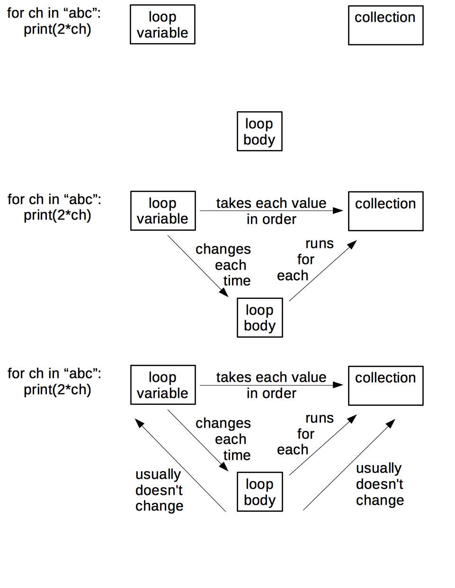

# Expertise and Memory

The previous chapter looked at what distinguishes novices from
competent practitioners.  Here, we will look at expertise: what it is,
how people acquire it, and how it can be harmful as well as helpful.
We will then see how concept maps can be used to figure out how to
turn knowledge into lessons.

To start, what do we mean when we say someone is an expert?  The usual
response is that they can solve problems much faster than people who
are "merely competent", or that they can recognize and deal with the
cases where the normal rules don't apply.  They also somehow make this
look effortless: in most cases, they just know what the right answer
is.

What makes someone an expert? The answer isn't just that they know
more facts: competent practitioners can memorize a lot of trivia
without any noticeable improvement to their performance.  Instead,
imagine for a moment that we store knowledge as a graph in which facts
are nodes and relationships are arcs. (This is emphatically *not* how
our brains work, but it's a useful metaphor.) The key difference
between experts and people who are "merely competent" is that experts
have many more connections, i.e., their mental models are much more
densely connected.

This metaphor helps explain many observed aspects of expert behavior:

*   Experts can jump directly from a problem to its solution because
    there actually is a direct link between the two in their mind.
    Where a competent practitioner would have to reason "A, B, C, D,
    E", the expert can go from A to E in a single step. We call
    this *intuition*, and it isn't always a good thing: when asked
    to explain their reasoning, experts often can't, because they didn't
    actually reason their way to the solution–they just recognized it.

*   Experts are frequently so familiar with their subject that they can
    no longer imagine what it's like to *not* see the world that
    way. As a result, they are often less good at teaching the subject
    than people with less expertise who still remember what it's like
    to have to learn the things. This phenomenon is called _[expert
    blind spot](GLOSSARY.md#(GLOSSARY.md#xpert-blind-spot))_, and
    while it can be overcome with training, it's part of why there is
    no correlation between how good someone is at doing research in an
    area and how good they are at teaching it
    {{"marsh-hattie-teaching"|cite}}.

*   Densely-connected knowledge graphs are also the basis for experts'
    _[fluid representations](GLOSSARY.md#fluid-representation)_, i.e.,
    their ability to switch back and forth between different views of
    a problem {{"petre-expertise"|cite}}.  For example, when trying to
    solve a problem in mathematics, we might switch between tackling
    it geometrically and representing it as a set of equations to be
    solved.

*   Finally, this metaphor also explains why experts are better at
    diagnosis than competent practitioners: more linkages between facts
    makes it easier to reason backward from symptoms to causes. (And
    this in turn is why asking programmers to debug during job
    interviews gives a more accurate impression of their ability than
    asking them to program.)

> **The J Word**
>
> Experts often betray their blind spot by using the word "just" in
> explanations, as in, "Oh, it's easy, you just fire up a new virtual
> machine and then you just install these four patches to Ubuntu and
> then you just re-write your entire program in a pure functional
> language." As we discuss later in [Motivation](/motivation/), the J word
> (also sometimes called the passive dismissive adjective) should be
> banned from classrooms, primarily because using it gives learners the
> very clear signal that the instructor thinks their problem is trivial
> and that they therefore must be stupid.

The graph model of knowledge explains why helping learners make
connections is as important as introducing them to facts.  To use
another analogy, the more people you know in a group, the more likely
you are to remain part of that group.  Similarly, the more connections
a fact has to other facts, the more likely the fact is to be
remembered.

> **Repetition vs. Deliberate Practice**
> 
> The idea that ten thousand hours of practice will make someone an
> expert in some field is widely quoted, but reality is more complex.
> Doing exactly the same thing over and over again is much more likely
> to solidify bad habits than perfect performance.  What actually
> works is _[deliberate practice](GLOSSARY.md#deliberate-practice)_
> (also sometimes called _[reflective
> practice](GLOSSARY.md#reflective-practice)_), which is doing similar
> but subtly different things, paying attention to what works and what
> doesn't, and then changing behavior in response to that feedback to
> get cumulatively better.
> 
> A common progression is for people to go through three stages:
> 
> 1.  They *learn how to do something given feedback from others*.
>     For example, they might write an essay about what they did on their
>     summer holiday, and get feedback from a teacher telling them how to
>     improve it.
> 
> 2.  They *learn how to give feedback*.  For example, they might
>     write an essay about character development in *The Catcher in
>     the Rye*, and get feedback on their critique from a teacher.
> 
> 3.  They *apply what they've learned about feedback to themselves*.
>     At some point, they start critiquing their own work in real time (or
>     nearly so) using the critical skills they've built up in steps 1 and
>     2.  Doing this is so much faster than waiting for feedback from
>     others that proficiency suddenly starts to take off.
> 
> A meta-study conducted in 2014 {{"macnamara-deliberate"|cite}} found
> that "…deliberate practice explained 26% of the variance in
> performance for games, 21% for music, 18% for sports, 4% for
> education, and less than 1% for professions." One explanation for
> this variation is that deliberate practice works best when the rules
> for evaluating success are very stable, but is less effective when
> there are more factors at play (i.e., when it's harder to connect
> cause to effect).

## Concept Maps

Our tool of choice to represent a knowledge graph (expert or
otherwise) is a _concept map(GLOSSARY.md#concept-map)_.  A concept map
is simply a picture of someone's mental model of a domain: facts are
bubbles, and connections are labelled arcs. It is important that they
are labelled: saying "X and Y are related" is only helpful if we
explain what the relationship *is*. And yes, one person's fact may be
another person's connection, but one of the benefits of concept
mapping is that it makes those differences explicit.

> **Externalizing Cognition**
> 
> Concept maps are just one way to represent our understanding of a
> subject.  For example, Andrew Abela's [decision tree][abela-chart]
> presents a mental model of how to choose the right kind of chart for
> different kinds of questions and data.  Maps, flowcharts, and
> blueprints can also be useful in some contexts.  What each does is
> _[externalize
> cognition](GLOSSARY.md#(GLOSSARY.md#xternalized-cognition))_, i.e.,
> make thought processes and mental models visible so that they can be
> compared, contrasted, and combined.

To show what concept maps look like, consider this simple `for
loop in Python:

~~~
for letter in "abc":
      print('*' + letter)
~~~

whose output is:

~~~
*a
*b
*c
~~~

The three key "things" in this loop are shown in the first part of the
figure below, but they are only half the story–and arguably, the less
important half.  The second part shows the *relationships* between
those things.  We can go further and add two more relationships that
are usually (but not always) true as shown in the third part.

Concept maps can be used in many ways:

1.  Concept maps aid design of a lesson by helping authors figure out
    what they're trying to teach. Crucially, a concept map separates
    content from order: in our experience, people rarely wind up
    teaching things in the order in which they first drew them.

2.  They also aid communication between lesson designers. Instructors
    with very different ideas of what they're trying to teach are likely
    to pull their learners in different directions. Drawing and sharing
    concept maps isn't guaranteed to prevent this, but it certainly
    helps.

3.  Concept maps also aid communication with learners. While it's
    possible to give learners a pre-drawn map at the start of a lesson
    for them to annotate, it's better to draw it piece by piece while
    teaching to reinforce the ties between what's in the map and what
    the instructor said. (We will return to this idea when we discuss
    Mayer's work on multimedia learning in [Cognitive Load](/load/).

4.  Concept maps are also a useful for assessment: having learners draw
    concept maps of what they think they just heard shows the instructor
    what was missed and what was mis-understood.  However, reviewing
    learners' concept maps is too time-consuming for use in class, but
    very useful in weekly lectures *once learners are familiar with
    the technique*.  The qualification is necessary because any new way
    of doing things initially slows people down–if a student is trying
    to make sense of basic economics, asking them to figure out how to
    draw their thoughts at the same time is an unfair load.
    FIXME: Neil Brown is skeptical of whether novices can effectively
    map their understanding, since introspection and explanation of
    understanding are generally more advanced skills than
    understanding itself.

> **Meetings, Meetings, Meetings**
> 
> The next time you have a team meeting, give everyone a sheet of paper
> and have them spend a few minutes drawing a concept map of the project
> you're all working on–separately. On the count of three, have
> everyone reveal their concept maps simultaneously. The discussion that
> follows everyone's realization of how different their mental models of
> the project's aims and organization are is always interesting…

## Seven Plus or Minus Two

The graph model of knowledge is wrong but useful, but another simple
model has a sound physical basis.  As a rough approximation, human
memory can be divided into two distinct layers. The first is called
_[long-term](GLOSSARY.md#long-term-memory)_ or _[persistent
memory](GLOSSARY.md#persistent-memory)_. It is where we store things
like our password, our home address, and what the clown did at our
eighth birthday party that scared us so much. It is essentially
unbounded: barring injury or disease, we will die before it fills up.
However, it is also slow to access–too slow to help us handle hungry
lions and disgruntled family members.

Evolution has therefore given us a second system called
_[short-term](GLOSSARY.md#short-term-memory)_ or _[working
memory](GLOSSARY.md#working-memory)_. It is much faster, but also much
smaller: in 1956, Miller estimated that the average adult's working
memory could hold 7±2 items for a few seconds before things started to
drop out[^1]. This is why phone numbers are typically 7 or 8 digits
long: back when phones had dials instead of keypads, that was the
longest string of numbers most adults could remember accurately for as
long as it took the dial to go around and around. It's also why sports
teams tend to have about half a dozen members, or be broken down into
smaller groups (such as the forwards and backs in rugby).

> **Chunking**
> 
> Our minds can store larger numbers of facts in short-term memory by
> creating _[chunks](GLOSSARY.md#chunking)_. For example, most of us
> will remember a word we read as a single item, rather than as a
> sequence of letters.  Similarly, the pattern made by five spots on
> cards or dice is remembered as a whole rather than as five separate
> pieces of information.  Chunks allow us to manage larger problems,
> but can also mislead us if we mis-identify something, i.e., see it
> as something it isn't.
>
> FIXME: experts have more and larger chunks.  Refer forward to
> the material from Neil Brown on patterns in "Load".

7±2 is probably the most important number in programming. When
someone is trying to write the next line of a program, or understand
what's already there, she needs to keep a bunch of arbitrary facts
straight in her head: what does this variable represent, what value
does it currently hold, etc. If the number of facts grows too large,
her mental model of the program comes crashing down (something we have
all experienced).

7±2 is also the most important number in teaching. An instructor
cannot push information directly into a learner's long-term
memory. Instead, whatever she presents is first represented in the
learner's short-term memory, and is only transferred to long-term
memory after it has been held there and rehearsed. If we present too
much information too quickly, the new will displace the old before it
has a chance to consolidate in long-term memory.

This is why it's very important to use a technique like concept
mapping a lesson before teaching it - an instructor needs to identify
just how many pieces of separate information will need to be
"stored" in memory as part of the lesson.

> **Building Concept Maps Together**
> 
> Concept maps can be used as a classroom discussion exercise. Put
> learners in small groups (2-4 people each), give each group some sticky
> notes on which a few key concepts are written, and have them build a
> concept map on a whiteboard by placing those sticky notes, connecting
> them with labelled arcs, and adding any other concepts they think they
> need.

<!-- -->

> **What Are We Doing Again?**
> 
> Concept maps can also be used to help build a shared understanding of
> what a project is trying to accomplish. Everyone independently draws a
> concept map to show what they think the project's goals and constraints
> are. Those concept maps are then revealed simultaneously. The ensuing
> discussion can be…vigorous.

## Challenges

### Concept Mapping

Create a hand drawn concept map for something you would teach in five
minutes.  (If possible, do it for the same subject that created a
multiple choice question for earlier.) Trade with a partner, and
critique each other's maps. Do they present concepts or surface
detail? Which of the relationships in your partner's map do you
consider concepts and vice versa?

---

**Footnotes**

[^1]: More recent estimates put the number closer to 4±1, which means
that effective chunking is even more important than first thought.

----

 

[abela-chart]: http://extremepresentation.typepad.com/files/choosing-a-good-chart-09.pdf
[serial-position]: http://cat.xula.edu/thinker/memory/working/serial
